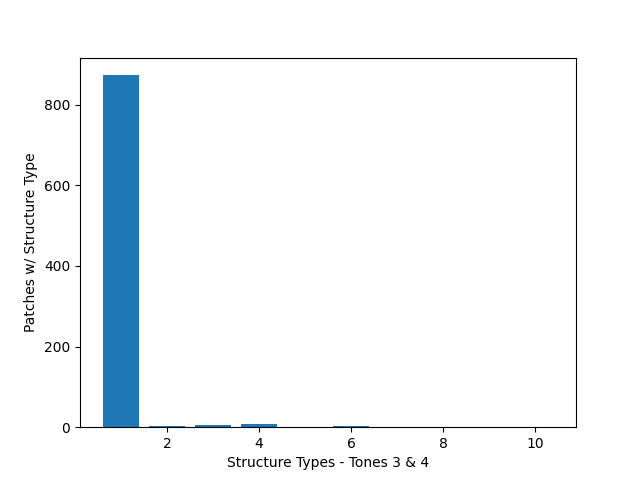
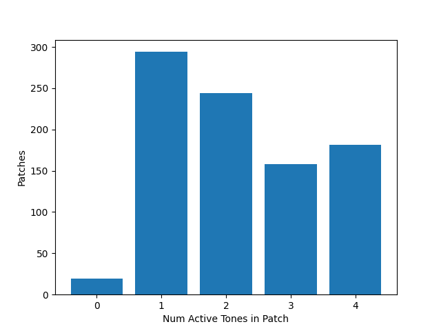
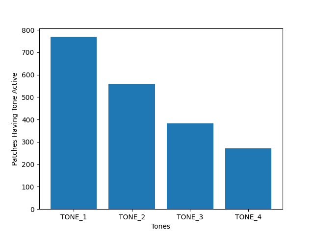

## Tone structures

The Structure parameter determines how tones tones 1 and 2 (and 3 and 4) are 
connected. Structure 1 means that there is no connection, other structures
combine tones either within a ring modulator or gain booster. 

As shown below, the vast majority of patches in the dataset use structure 1.
This means that in most cases, the tone number (1-4) assigned to each tone is
arbitrary, meaning that the patch would sound the same if tones 1 and 2 (for 
example) were swapped. This is important for both augmenting the dataset and
preventing overfitting: new patches can be created by swapping the tones in
existing patches which both increases the dataset size and prevents overfitting
a certain tone parameter from being associated with the specific tone as it appeared 
in the original dataset.

Patches using each structure (Tones 1 and 2):

Patches using each structure (Tones 3 and 4):

## Active tones

Patches can have 1-4 tones active, here are summaries of the active tones in
patches. (Patches with 0 tones active should be removed from dataset!)

The number of tones active in each patch:

Tones active in each patch:

